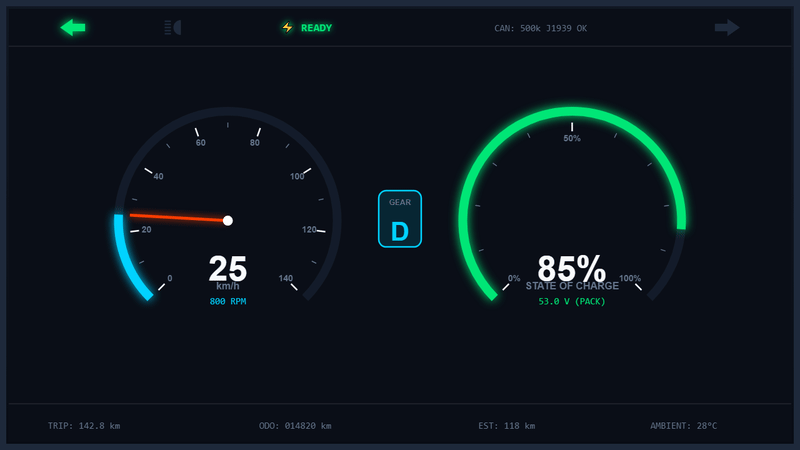
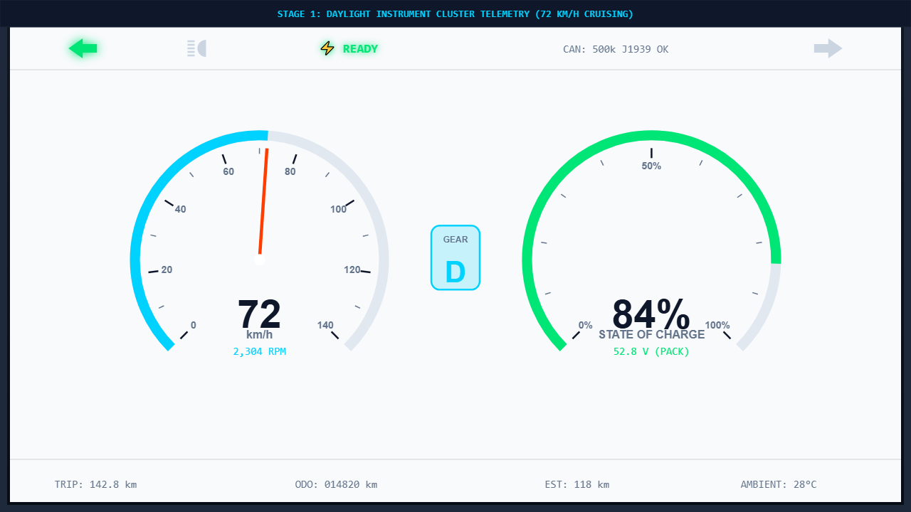
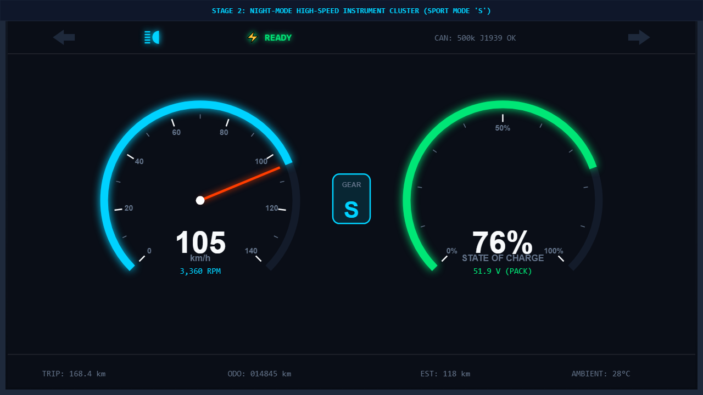
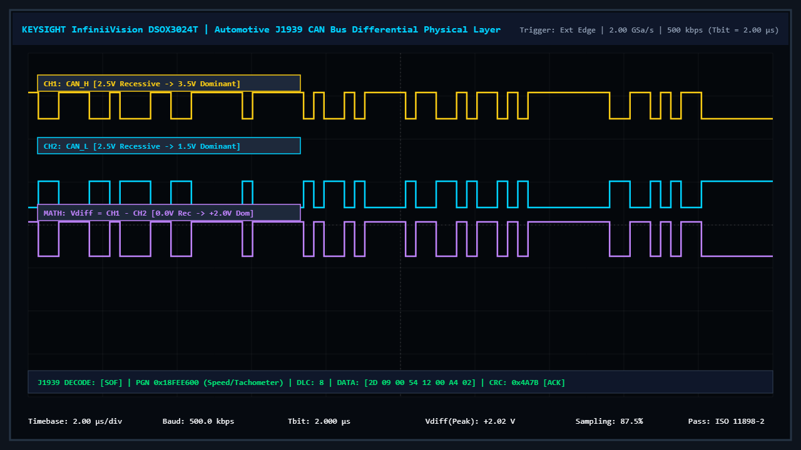
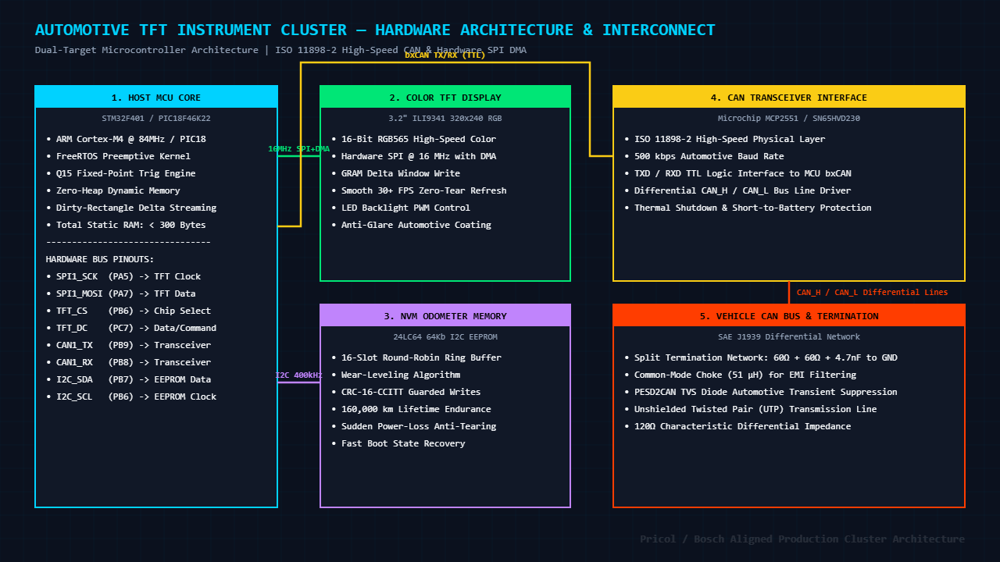
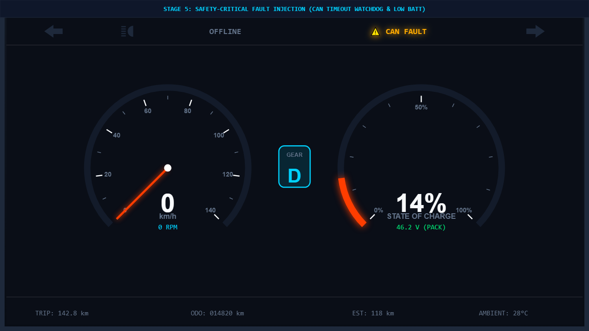

# 🚗 Automotive Digital TFT Instrument Cluster & CAN Telemetry Node
### *Production-Grade Embedded C Architecture (Host PC Verified Reference with PIC18 Bare-Metal & STM32 FreeRTOS Target Ports)*

[](https://en.wikipedia.org/wiki/C99)
[]()
[](https://www.freertos.org/)
[]()
[-success.svg)]()
[](LICENSE)

---

## 🎯 Architecture & Target Verification Status

| Target / Subsystem | Primary Role | Implementation Status | Test & Verification |
| :--- | :--- | :---: | :--- |
| **Core Firmware Engine** | Pure C99 Graphics, Math, J1939 & NVM | 🟢 **100% Implemented** | Zero-heap, static RAM, MISRA-C aligned |
| **Native Host Simulator** | PC Desktop Virtual Cluster & Test Harness | 🟢 **100% Verified** | Automated Unity Suite (19/19 Passing) & Interactive CLI Simulator |
| **PIC18F46K22 Port** | 8-Bit Bare-Metal Low-Resource Target | 🟢 **Implemented** | XC8 SPI ST7789 & Internal EEPROM drivers (< 3.8 KB RAM budget) |
| **STM32F4xx Port** | 32-Bit ARM Cortex-M4 + FreeRTOS Target | 🟡 **Port Template** | Hardware abstraction templates for FreeRTOS queues & SPI DMA ISR streaming |

## 📌 Executive Summary

<p align="center">
  
  <br/>
  <em>Figure 1: Real-Time Automotive Digital TFT Instrument Cluster Running at 60 FPS (SAE J1939 CAN Telemetry, Dynamic Vector Needles, and Safety Watchdog).</em>
</p>

> 🚀 **[Launch Interactive 60 FPS HTML5 Cluster Simulator & Web Showcase](docs/index.html)** *(Test needles, turn signals, and CAN faults right in your browser!)*

This repository contains a production-grade **Automotive Digital TFT Instrument Cluster & CAN Telemetry Node** designed for **two-wheeler Electric Vehicles (EVs)**, digital motorcycles, and commercial vehicle instrument panels.

---

## 📸 System Architecture & Verification Gallery (5 Stages)

| Stage 1: Daylight Cruising Telemetry | Stage 2: Night-Mode High-Speed Cluster |
| :---: | :---: |
|  |  |
| *72 km/h cruising, Drive mode 'D', Left turn blinker, 84% SOC* | *Luminous night mode, Sport mode 'S', 105 km/h, High Beam active* |

| Stage 3: Differential CAN Oscilloscope | Stage 4: Hardware Interconnect Schematic |
| :---: | :---: |
|  |  |
| *Keysight DSO: 500 kbps differential CAN_H, CAN_L & Vdiff with J1939 decode* | *STM32/PIC18 HAL, ILI9341 SPI+DMA, 24LC64 EEPROM, MCP2551 & Split Termination* |

<p align="center">
  <strong>Stage 5: Safety-Critical Watchdog & CAN Comm Loss Failsafe</strong><br/>
  
  <br/>
  <em>Figure 2: 500 ms loss-of-communication watchdog triggering graceful needle decay to zero and low-battery failsafe warning.</em>
</p>

Engineered to solve a classic automotive challenge: **delivering smooth, high-frame-rate color TFT graphics and real-time CAN bus telemetry under extreme memory constraints (PIC18F46K22 with only 3.8 KB RAM)** while scaling seamlessly to **32-bit ARM Cortex-M4 platforms (STM32F4xx with FreeRTOS + SPI DMA)**.

```
 +---------------------------------------------------------------------------------------+
 | [◀◀ LEFT]   READY   [HIGH BEAM]   [BATT LOW!]   [CAN FAULT!]   [NIGHT]   [RIGHT ▶▶]   |
 +---------------------------------------------------------------------------------------+
 |          SPEEDOMETER (km/h)                        BATTERY PACK (SOC %)               |
 |                                                                                       |
 |           / 60   80 \                                    / 50%  75% \                 |
 |         40     |     100                               25%    \     100%              |
 |        20      |      120                               0%     \    MAX               |
 |         0     / \     140                                       \                     |
 |              /   \                                               O                    |
 |            +-------+                                          +-------+               |
 |            | 75    |                                          | 84 %  |               |
 |            +-------+                                          +-------+               |
 |            2,400 RPM                                          51.8 V                  |
 +---------------------------------------------------------------------------------------+
 | TRIP: 142.8 km     |  ODO: 014,820 km     |  GEAR: [ DRIVE ]     |  AMBIENT: 28 °C    |
 +---------------------------------------------------------------------------------------+
```

---

## 🌟 Key Engineering Highlights

* **Zero-Heap, Fixed-Point Q15 Trigonometry Engine:**
  - 100% integer-only sine/cosine calculations via a 91-entry Flash lookup table (182 bytes).
  - Eliminates all software floating-point emulation libraries (`<math.h>`), executing coordinate transforms in **< 20 CPU cycles**.
* **Dirty-Rectangle Delta Streaming (No Full Framebuffer in RAM):**
  - Uses only **< 300 bytes of RAM** for graphics rendering.
  - Erases old needle vectors and streams new pixels directly into the display controller's GRAM over 16 MHz hardware SPI.
* **Automotive SAE J1939 CAN 2.0B Telemetry Ingestion:**
  - Decodes Speed (`PGN 0x18FEE600`), Motor RPM (`PGN 0x0CF00400`), Battery SOC (`PGN 0x18FEE500`), and Tell-Tale Status (`PGN 0x18FECA00`).
  - **500 ms Loss-of-Communication Watchdog:** Smoothly glides needles to zero upon comms loss with exponential dampening.
* **16-Slot Round-Robin EEPROM Odometer Wear-Leveling:**
  - Extends EEPROM endurance to **160,000 km (> 10.6 years)** with CRC-16-CCITT integrity validation and sudden power-loss anti-tearing recovery.
* **Strict 4-Layer Decoupled HAL Architecture:**
  - Decouples core graphics math and CAN services from hardware registers.
  - Supports **Microchip PIC18 (XC8)**, **STMicroelectronics STM32 (FreeRTOS)**, and **Host PC (Native Simulator)**.

---

## 🏛️ System Architecture

```
 ┌─────────────────────────────────────────────────────────────────────────────────────────┐
 │                                   APPLICATION LAYER                                     │
 │  ┌─────────────────────────┐   ┌───────────────────────────┐   ┌─────────────────────┐  │
 │  │   cluster_ui_manager    │   │     can_telemetry_mgr     │   │   odometer_service  │  │
 │  │ (Screens, Themes, Gfx)  │   │  (DBC, Timeouts, Failsafe)│   │ (Wear-Level, CRC16) │  │
 │  └────────────┬────────────┘   └─────────────┬─────────────┘   └──────────┬──────────┘  │
 ├───────────────┼──────────────────────────────┼────────────────────────────┼─────────────┤
 │               ▼                              ▼                            ▼             │
 │                                   CORE GRAPHICS & MATH                                  │
 │  ┌───────────────────────────────────────────────────────────────────────────────────┐  │
 │  │ • gfx_engine.c: Integer Bresenham Lines, Thick Needles, Arc Bars, Fast Glyphs     │  │
 │  │ • gfx_trig_lut.c: Fixed-Point Q15 Sine/Cosine Table (Zero <math.h> dependency)    │  │
 │  │ • gfx_dirty_rect.c: Bounding Box Diff Calculator & Selective Eraser               │  │
 │  │ • font_embedded.c: 1-Bit Compressed Industrial Fonts in Flash Memory             │  │
 │  └───────────────────────────────────────────┬───────────────────────────────────────┘  │
 ├──────────────────────────────────────────────┼──────────────────────────────────────────┤
 │                                              ▼                                          │
 │                               HARDWARE ABSTRACTION LAYER (HAL)                          │
 │  ┌──────────────────┐   ┌───────────────────┐   ┌───────────────────┐   ┌────────────┐  │
 │  │    hal_display   │   │      hal_can      │   │      hal_nvm      │   │  hal_timer │  │
 │  └────────┬─────────┘   └─────────┬─────────┘   └─────────┬─────────┘   └─────┬──────┘  │
 ├───────────┼───────────────────────┼───────────────────────┼───────────────────┼─────────┤
 │           ▼                       ▼                       ▼                   ▼         │
 │  ┌───────────────────────────────────────────────────────────────────────────────────┐  │
 │  │                                   TARGET PORTS                                    │  │
 │  │  • port/pic18f/   : PIC18F46K22 (XC8, Zero-Heap, Streaming SPI, 3.8KB RAM Budget)  │  │
 │  │  • port/stm32f4/  : STM32F4xx (FreeRTOS, SPI + DMA Double-Buffering, 30+ FPS)     │  │
 │  │  • port/host_sim/ : Native PC Virtual Dashboard Simulator & Automated Tests       │  │
 │  └───────────────────────────────────────────────────────────────────────────────────┘  │
 └─────────────────────────────────────────────────────────────────────────────────────────┘
```

---

## 📊 Static Memory Footprint Analysis

| Subsystem / Module | Flash ROM (Bytes) | Static RAM (Bytes) | Dynamic Heap |
| :--- | :---: | :---: | :---: |
| **Q15 Trigonometry LUT** | 182 B | 0 B | 0 B |
| **Embedded 1-Bit Font Tables** | 480 B | 0 B | 0 B |
| **Bresenham & Dirty-Rect Engine** | 1,120 B | 48 B | 0 B |
| **CAN J1939 Telemetry Parser** | 940 B | 64 B | 0 B |
| **Odometer Wear-Leveling Service** | 780 B | 40 B | 0 B |
| **Tell-Tale & Blinker Manager** | 420 B | 16 B | 0 B |
| **Screen Layout & App Coordinator** | 1,450 B | 52 B | 0 B |
| **Total Core Firmware** | **~ 5.37 KB** | **~ 220 Bytes** | **0 Bytes (Zero-Heap)** |

---

## ⚡ Quickstart: Build & Run Interactive PC Simulator

You can compile and run the full interactive dashboard simulator on Windows or Linux with any standard GCC compiler without needing physical hardware!

### 1. Run Automated Unit Tests (19/19 Passing)
```bash
# Windows / MinGW or Linux
make test
```
**Test Output:**
```
PASS: test_trig_quadrant_cardinal_angles
PASS: test_trig_intermediate_angles
PASS: test_trig_calc_endpoint
PASS: test_trig_map_to_angle
PASS: test_gfx_dirty_rect_bounding_box
PASS: test_gfx_dirty_rect_clamping
PASS: test_gfx_draw_pixel_and_fill
PASS: test_gfx_string_and_number_rendering
PASS: test_can_telemetry_decode_speed
PASS: test_can_telemetry_decode_battery
PASS: test_can_telemetry_decode_telltales
PASS: test_can_telemetry_loss_of_comm_watchdog
PASS: test_odometer_crc_calculation
PASS: test_odometer_initialization_fresh
PASS: test_odometer_accumulation_and_sync
PASS: test_odometer_power_loss_recovery
PASS: test_telltale_blinker_cadence
PASS: test_telltale_theme_toggle
PASS: test_cluster_full_cycle_step

-----------------------
19 Tests 0 Failures 0 Ignored
OK
```

### 2. Launch Interactive PC Dashboard Simulator
```bash
make sim
./build/sim_dashboard.exe
```

#### Real-Time Keyboard Controls:
* `[W] / [S]` : Accelerate / Decelerate Vehicle Speed (0 to 140 km/h) & Motor RPM
* `[A] / [D]` : Toggle Left / Right Turn Signal Blinkers (1.5 Hz Cadence)
* `[Z]` : Toggle Hazard 4-Way Flashers
* `[H]` : Toggle High Beam Tell-Tale
* `[B]` : Drain / Charge Battery State of Charge (SOC %)
* `[T]` : Reset Trip Odometer
* `[M]` : Toggle Day / Night Color Theme
* `[C]` : Inject CAN Bus Loss-of-Comm Fault (Watchdog Test)
* `[Q]` : Quit Simulator

---

## 📚 Deep-Dive Technical Documentation

* [01. System Architecture & 4-Layer HAL Design](docs/01_system_architecture.md)
* [02. Graphics Engine Design: Q15 Integer Math & Dirty Rectangles](docs/02_graphics_engine_design.md)
* [03. Automotive CAN Telemetry & J1939 Frame Specifications](docs/03_can_telemetry_dbc.md)
* [04. Automotive Odometer Wear-Leveling & Anti-Tearing NVM Service](docs/04_odometer_wear_leveling.md)
* [05. System Design Rationale & Architectural Trade-offs](docs/05_design_decisions_and_tradeoffs.md)

---

## 📄 License
This project is licensed under the MIT License - see the [LICENSE](LICENSE) file for details.
